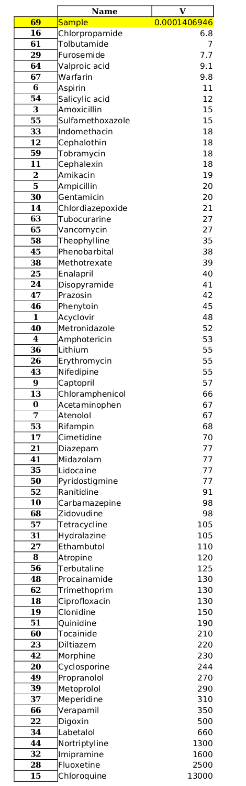

Comparison With Known Data
**************************

Known Data
==========

Known data is a database containing names and related V\ :sub:`d` \ values of various drugs. It is also an .csv file.

.. csv-table::
    :header: File type, Name Data, :math:`V_d` Data

    csv, Name, V

.. caution::
    Entertaining other headings will not work.

This is a sample data

.. csv-table::
    :header: Name, V

    Acetaminophen, 67
    Amikacin, 19
    Amoxicillin, 15
    Amphotericin, 53
    Ampicillin, 20
    Tubocurarine, 27
    Valproic acid, 9.1
    Vancomycin, 27
    Verapamil, 350
    Warfarin, 9.8
    Zidovudine, 98

Comparison
==========

Comparison is achieved by below written steps:

#. The provided dataset is read.
#. The Volume Distribution value is appended.
#. At last, that is sorted by the values of Volume Distribution, in ascending manner, and is exported.
    
Output of Comparison
====================

After the successful completion of the program, one file will be generated. Details are given below

.. csv-table::
    :header: Name, Insight

    File name, Comparison_Dataset
    File type, .xlsx
    Sheet Name, Comparison Sheet
    Column, Name and V
    Row, Index numbers from parent dataset

Below is an image of exported data sheet (the sample and corresponding Volume Distribution value is highlighted)

.. note::
    In original exported version, the sample and volume Distribution value will not be highlighted.